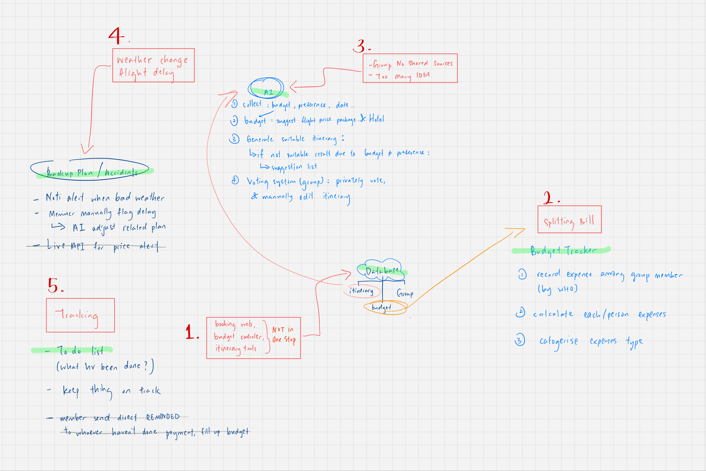
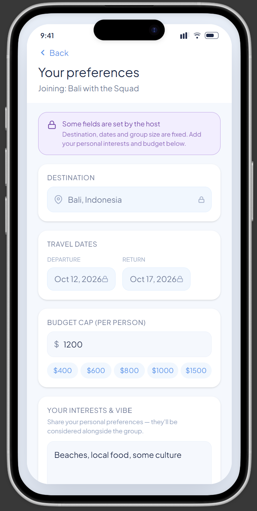
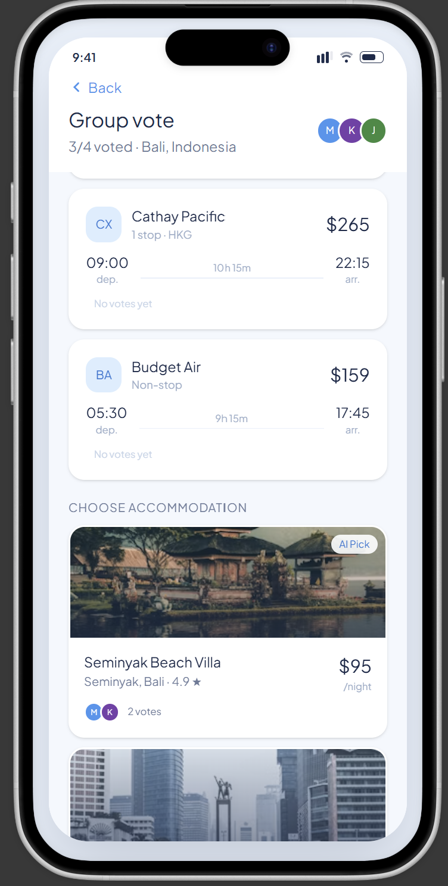
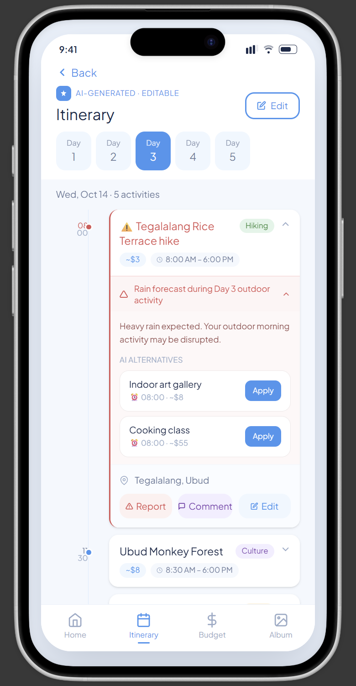
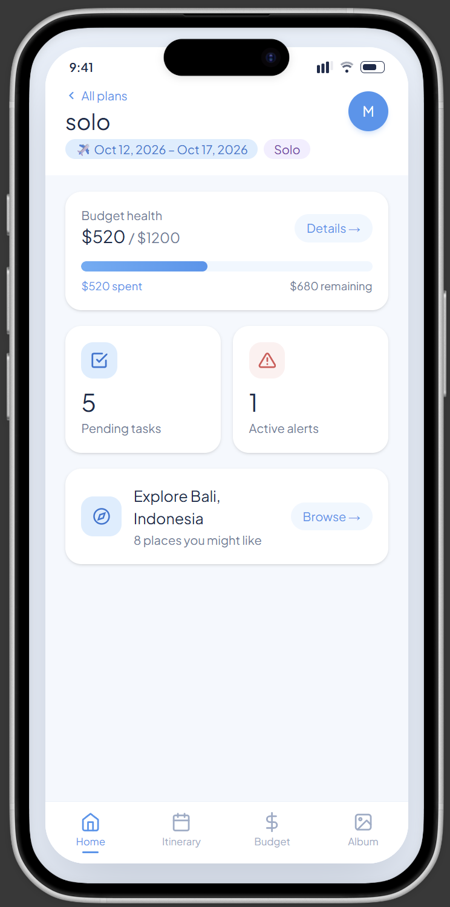
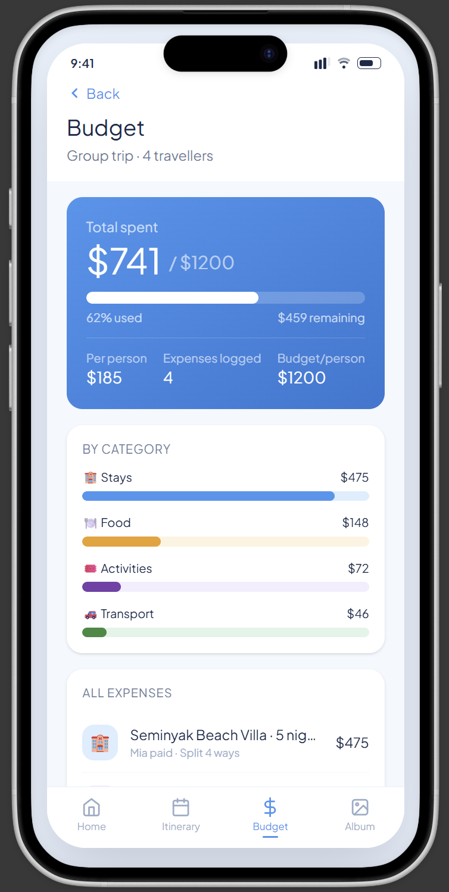
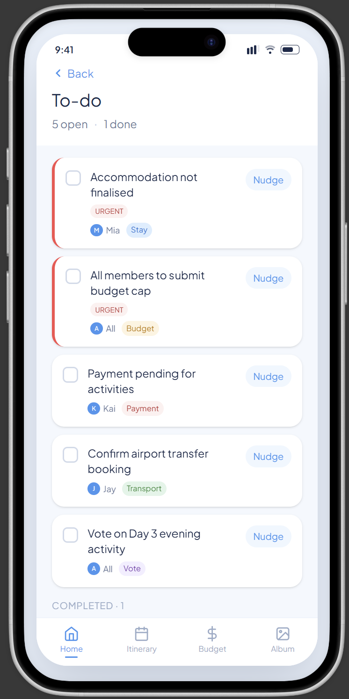
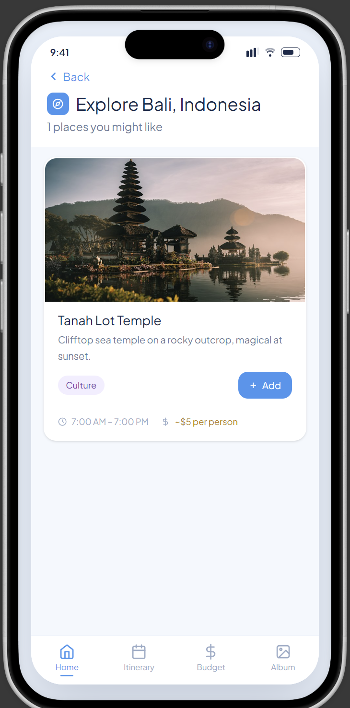
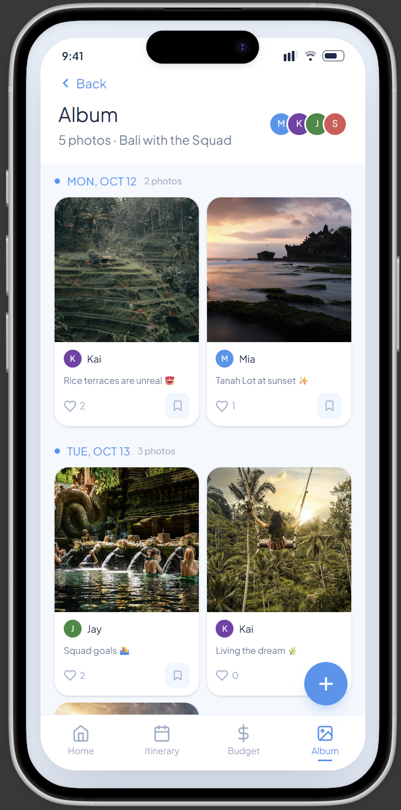

# LetsGO by Apolo
Team: Abigail Lim, Yeap Shuwei, Chang Ru Yi  
Problem Statement: Travel Planner
Video Presentation: https://youtu.be/bDpBLqzXStw 
Presentation Slides: https://canva.link/5y3qqj2dd2i0m4o 

## Project Overview

### 1. Cause / Problem

Trip planning today is scattered across too many disconnected tools and channels. Booking, budgeting, and itinerary apps are single-purpose, forcing travellers to manually reconcile information across different apps plus a group chat. As preferences live in scattered conversations, decisions are hard to finalise, and ideas get lost. Attraction and itinerary information which spread across many different websites makes it difficult to get the latest info and lock in a final plan. Real-world disruptions like delays, cancellations, or bad weather aren't factored into any planning tool, leaving travellers without alerts or a backup plan mid-trip. There is also no system for splitting costs fairly or tracking who's paid, which leads to lost money, unclaimed refunds, and uneven bill-splitting, hence tasks and payments get lost easily in chats for larger groups, risking duplicated bookings or payments. Even for solo travellers, generic itineraries do not adjust to their actual budget or interests, so they end up doing the same manual piecing-together work as a group would.

### 2. Stakeholder
- **Solo travellers**:  
These users are currently stuck with generic, one-size-fits-all itineraries that don't adjust to their actual budget or interests.
- **Group trip organisers**:  
The one person who usually ends up doing all the coordinating such as chasing everyone's preferences, tracking the budget, and stitching bookings together across apps.
- **Group members**:  
Their preferences often get lost in; chat threads, or overridden by whoever speaks up first.
- **Budget-conscious travellers**  
These users need a fair, accurate cost splitting or clear tracking of payment, especially within a big group.
- **Travellers facing mid-trip disruptions**  
Flight delays, cancellations, or bad weather can ruin a fixed plan, and none of the current tools step in to help re-plan on the spot.

### 3. Similar Apps and Why They Fall Short

| App | Usage | Shortfall |
|---|---|---|
| **TripIt** | Pulling itinerary info from forwarded confirmation emails and sharing it with a group | Does not build recommendation maps, suggest activities, or handle budgeting/cost-splitting |
| **Splitwise** | The go-to for expense tracking and settling up after a trip | No itinerary, booking, or planning features |
| **Wanderlog** | Map-based itinerary planning with budget tracking and shareable plans | No AI-personalised itinerary generation, no disruption handling when plans change mid-trip |

### 4. Our Solution 

LetsGO is a mobile app that can be used from the planning till the end of the trip. It brings itinerary planning, budgeting, destination discovery, and group coordination into one shared data model, so a trip is planned, tracked, and adjusted in a single place instead of five. Members submit their budget, interests, and travel dates, where LetsGO's AI generates flight and accommodation options and an itinerary fitting the group's (or solo traveller's) combined constraints. An Explore feed surfaces destination-specific suggestions to add straight into the itinerary, and a single dashboard shows budget health, tasks, and alerts at a glance. When something changes, the AI adjusts only the affected part of the plan. Members can also save shared or personal photos in an in-app album.

**Feature set:**
- Shared trip dashboard (budget health + pending tasks + alerts + explore, at a glance)
- Preference intake (budget cap, interests, dates) for solo or group members
- AI-generated flight/accommodation options (with private group voting) and itinerary, editable manually
- AI-generated alternatives with explanation when no suitable match is found (overbudget issues)
- Explore section: destination and interest-based place suggestions, one-tap add to itinerary
- Real-world alert triggers (weather issues) and manual issue flagging (delay / opening hours)
- AI-suggested partial itinerary adjustments (no full regeneration which overrides planned ones)
- Expense logging with configurable cost-splitting and a per-category visual spend tracker
- Persistent to-do checklist for unresolved trip items
- Shared/solo photo album with save and like functionality

---

## Ideation Process

### 1. Ideas Considered

| Big Idea | Sub Ideas | Kept / Dropped | Why |
|---|---|---|---|
| **One shared trip data model** | A same database/app where all itinerary, budget, and group all live in. | Kept | This fixes the main problem. Now everything is split across different apps and a group chat, so nothing stays in sync. |
| | Dashboard showing itinerary status, budget health, and pending tasks together at a glance, instead of separate screens per pillar. | Kept | Just having one database isn't enough, people still need one screen where they can see everything at once instead of clicking around. |
| | An explore section from the dashboard which recommends places based on destination and interest given. | Kept | Provides alternative suggestions of places to visit in the travel destination. |
| **Preference intake and itinerary generation (for group and solo trip)** | Preference Intake: each member / solo user submits their own budget cap, interests, and date of travel through the app. | Kept | We need this info first before the AI can actually build something useful. |
| | AI provides choices for flight schedules and prices, and suitable accommodations. | Kept | Save user time so they don't have to manually check flights and hotels across five different apps and websites. |
| | AI summary and itinerary generation which matches all preferences and best fits the group's combined / solo constraints. Itinerary generated can be updated manually. | Kept | Saves the user from getting a generic itinerary that doesn't fit their budget or interests — works for solo travellers too, not just groups. |
| | AI explanation and suggestion list given if no suitable result based on preference (such as budget doesn't match with interest venue). | Kept | If nothing matches, the app shouldn't just fail silently, it should tell the user why and offer alternatives. |
| | Voting on flight & accommodation options only. | Kept | Flight and accommodation are the two decisions everyone's stuck with once booked. A quick private vote avoids one person's pick locking in a choice the rest of the group didn't want. |
| **Real world alerts and backup plans suggestion** | Alert trigger with notification for bad weather. | Kept | Gives users time to prepare or change plans before bad weather actually ruins the day, instead of finding out too late. |
| | Any member/solo user can flag any issue manually such as flight delay. | Kept | Covers the stuff the app can't detect on its own, like a place being closed or an activity cancelled. |
| | AI suggestion to adjust affected parts, but does not regenerate the whole plan. | Kept | Only fixes the part that broke, nobody wants the whole trip rebuilt just because one thing changed. |
| | Live Price alert, when AI detects the price of flight and accommodation from the live API is in the range of budget that user submits, making a notification for the user. | Dropped | Needs a paid live API running constantly in the background, it will be too costly and complex to set up in 3 weeks. |
| **Budget tracker and cost splitting system** | Users can log an expense with the amount, the person who paid and chose how the payment is split (if group payment). | Kept | This is what actually replaces the messy manual tracking people currently do in a group chat or spreadsheet. |
| | Budget thermometer: per-category (stays/food/activities/transport) visual tracker that fills up as expenses log, so overspending is visible before it becomes a problem. | Kept | Lets people see they're overspending before it's too late, not after the trip when it's too late to fix. |
| **Accountability & follow-through** | To Do checklist: persistent view of unresolved items (accommodation not picked, member hasn't submitted budget, payment pending). | Kept | Give one clear place to check what's outstanding, instead of scrolling back through chat history. |
| | Album function where users can upload photos, save and like uploaded photos. | Kept | User can share their photos or keep their photos all in one app. |
| | Peer nudge: a member can send a direct one-tap reminder to whoever owns an outstanding task or payment, framed as a friend nudge rather than an app notification (can private message). | Dropped | The to-do checklist already tells people what's outstanding. A nudge feature is a nice extra, not something that solves a new problem. |

### 2. Ideation Board

The problems we discussed before creating our solution.

Ideas brainstormed based on the core problems and root causes we found in existing apps.

The user flow of our app from the starting home page to all pages with main functions.

### 3. Mentor Consultation
| Date | Mentor | Feedback Received | What Was Changed |
|---|---|---|---|
|13/9/2026| Janelle Tan | To add: Search Function in the explore page, and more pictures and details in itinerary. | We decided that search function in explore page will be a future extension, as it does not affect the main features of explore. The pictures and details will be added to the itinerary once it is built and connected to the AI server. |

---

## Prototype

UI Prototype: https://www.figma.com/make/FmaMwC5dhxR9XfrhCobnQs/LetsGO-prototype?t=mnQ8p6ppKkpQ3Y2J-20&fullscreen=1 

Step 1: Enter your preference after creating new / joining existing plan, which include destination, date, budget and interest.  
  
  
Step 2: Choose the flights and hotel which matches your budget. Voting occurs here for group plans.  
  
  
Step 3: AI summarises the preferences and generates an itinerary. Automated and manually added alerts are flagged as red, with re-plan suggestions. Itinerary can be edited manually, and comments can be added for each activity.  
  
  
This dashboard shows all the main functions and links to each pages.  
  
  
View your budget and log all your expenses here. For group expenses, log the spliting way to split the costs. All expenses are categorised. 
  
  
View and add tasks here.  
  
  
AI suggestions on destinations to visit based on preference entered. Destinations can be added directly to the itinerary.  
  
  
You can upload your photos to the album here. For an album in a group plan, photos can be liked and saved.  
  
 

## What Makes It Different

| Feature | Why It's Novel / The Twist |
|---|---|
| **Unified trip data model** | Most travel apps pick one lane — itinerary or budget or group chat. LetsGO treats these as facets of one live trip object, so a budget change or a newly-added Explore suggestion updates the same dashboard everyone's already looking at, instead of living in a separate app. |
| **In-app destination discovery tied to itinerary** | Existing all-in-one planners (TripIt, Wanderlog) still leave "what's worth doing here" to external search or review sites. LetsGO's Explore feed suggests places based on the trip's actual destination and each member's stated interests, with a direct "add to itinerary" action — discovery and planning happen in the same flow, not two separate habits. |
| **Partial re-plan on disruption** | Existing apps either don't react to disruptions at all, or force a full itinerary regeneration when one thing changes. LetsGO's AI patches only the affected leg (e.g. re-suggesting one activity after a weather alert) — cheaper to compute and doesn't throw away decisions the group already made. |
| **Scoped, private voting** | Rather than voting on every open-ended decision (which risks becoming noise), LetsGO limits private, simultaneous-reveal voting to flight and accommodation choices — the two decisions with real cost and logistics tied to them, where a bad group compromise is expensive to undo. |
| **"Why it failed" explanations** | When no itinerary fits (budget vs. interests conflict), most planners either silently degrade the result or just say "no results." LetsGO's AI explains the specific mismatch and offers concrete alternatives, turning a dead end into a next step. |
| **Budget thermometer per category** | Most trip-budgeting tools (Splitwise, spreadsheets) only total after the trip. Showing per-category burn live, next to the itinerary, catches overspending while there's still time to adjust plans. |
| **Trip-scoped shared album** | Photos stay attached to the same trip object as the itinerary and budget, rather than living in a separate camera roll, shared drive, or group chat thread — works identically for solo trips (personal album) and group trips (shared, likeable). |
| **Personalised for solo too** | Most competitors are built group-first, leaving solo travellers stuck with the same generic template as everyone else. LetsGO's itinerary adjusts to individual budget and interests just as much as it does for a group — so a solo trip gets the same personalised treatment, not a fallback mode. |

---

## Tech Architecture and Feasibility

### Tech Stack

| Layer | Choice | Why | Constraints to Expect |
|---|---|---|---|
| **Frontend (mobile)** | React Native with Expo | Single codebase for iOS + Android mobile app | Expo Go can't run custom native modules (BLE, native payments, etc.) |
| **Backend** | Supabase (Postgres + Auth + Storage + Edge Functions) | Postgres fits our data shape naturally (trip → members/expenses/itinerary/photos as normal foreign-key tables). | 60s function timeout. Projects pause after 7 days idle. |
| **Database and Live updates** | Supabase Prostgres and Realtime | Live votes, expense logs, itinerary edits, album likes changes instantly. | It needs row-level security policies set up correctly or subscriptions silently return nothing. |
| **AI itinerary generation, Explore suggestions & adjustments** | Google Gemini API (Flash models) via Supabase Edge Function | Free tier, no card required. Solid function-calling/structured JSON support for the itinerary/Explore screens, generous token throughput, well-documented SDK. | Free tier rate limits apply per-minute/per-day |
| **Flights & accommodation data** | Mocked dataset, with Duffel (test mode) for flight search and hotel properties. | A genuinely live, continuously-polled pricing feed was already flagged and dropped as too costly to run |Sandbox data only, not live pricing |
| **Weather alerts** | OpenWeatherMap API (free tier) | Simple REST call to flag bad weather on trip dates | Free tier has a request-per-minute cap |
| **Hosting/deployment** | EAS (build/preview) |Installable build or shareable link, no Apple/Google dev account needed.| Free tier caps at 30 builds/month|

### Build Plan & Scope (3-Week Window)

- **Week 1 — Foundation:** Supabase setup (Auth, Postgres schema with RLS policies from day one, Storage buckets, Edge Functions scaffold), navigation shell, preference intake, trip create and join. Tryout up the Gemini itinerary call and Duffel test-mode search early as these are the two external dependencies with the most integration risk, so validating them against the real schema early avoids late surprises.
- **Week 2 — Core features:** AI itinerary generation via Gemini (using Duffel Stays test hotels + Duffel Airways test flights as the seeded data, so results look realistic rather than static mocks), shared dashboard (budget health + tasks + alerts + Explore entry point) wired to Supabase Realtime, expense logging with split calculation, budget thermometer, Explore screen with seeded destination content.
- **Week 3 — Coordination & polish:** Flight/accommodation voting (live via Realtime), manual issue flagging and AI partial-adjustment flow through Gemini, weather alert integration via OpenWeatherMap, photo album (Storage upload, like, shared/solo view, RLS-scoped per trip), UI polish and bug fixing, plus a pass confirming RLS policies exist on every table before demo day.

**Explicitly out of scope for the hackathon build:**
- Live/continuously-polled flight and hotel pricing for current implementation.
- Manually addition of voting on destinations/activities/restaurants can be added in the future.
- One-tap notification reminder is not built here as it does not affect the usbility.
- In-app alerts are choosen instead of push notifications outside the app
- Even-split expenses only for this build, custom-ratio splitting is a later extension.
- If the app scaled to more complex queries, a SQL database could be introduced.
- iOS-first is a scope decision to reduce testing surface, not a technical limitation of the stack.