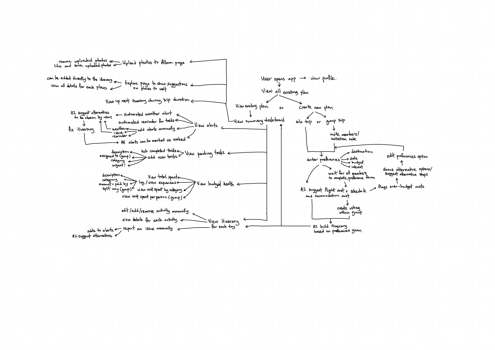

# LetsGO — Project README

## Project Overview

### 1. Cause / Problem

Trip planning today is scattered across too many disconnected tools and channels. Booking, budgeting, and itinerary apps are single-purpose, forcing travellers to manually reconcile information across roughly five apps plus a group chat. Group coordination has no shared source of truth — preferences live in scattered conversations, decisions are hard to finalise, and ideas get lost — while attraction and itinerary information spread across many different websites makes it difficult to get the latest info and lock in a final plan. Real-world disruptions like delays, cancellations, or bad weather aren't factored into any planning tool, leaving travellers without alerts or a backup plan mid-trip. There's also no system for splitting costs fairly or tracking who's paid, which leads to lost money, unclaimed refunds, and uneven bill-splitting, and tasks/payments easily get lost in chat threads for larger groups, risking duplicated bookings or payments. Even solo travellers aren't well served: generic itineraries don't adjust to their actual budget or interests, so they end up doing the same manual piecing-together work as a group would — planning still feels messy and scattered, just for a different reason.

### 2. Stakeholder
- **Solo travellers** — currently stuck with generic, one-size-fits-all itineraries that don't adjust to their actual budget or interests, so they end up doing the same manual piecing-together work as a group would.
- **Group trip organisers** — the one person who usually ends up doing all the coordinating: chasing everyone's preferences, tracking the budget, and stitching bookings together across apps. They carry most of the stress.
- **Group members** — want a say in the plan but don't want the responsibility of running it. Their preferences often get lost in chat threads, or overridden by whoever speaks up first.
- **Budget-conscious travellers (including students)** — need fair, accurate cost splitting and clear tracking of who's paid, since even small errors add up in a group.
- **Travellers facing mid-trip disruptions** — flight delays, cancellations, or bad weather can derail a fixed plan, and none of the current tools step in to help re-plan on the spot.

### 3. Similar Apps and Why They Fall Short

| App | Usage | Shortfall |
|---|---|---|
| **TripIt** | Pulling itinerary info from forwarded confirmation emails and sharing it with a group | Does not build recommendation maps, suggest activities, or handle budgeting/cost-splitting |
| **Splitwise** | The go-to for expense tracking and settling up after a trip | No itinerary, booking, or planning features |
| **Wanderlog** | Map-based itinerary planning with budget tracking and shareable plans | No AI-personalised itinerary generation, no disruption handling when plans change mid-trip |

### 4. Our Solution 

LetsGO is a mobile app that brings itinerary planning, budgeting, destination discovery, and group coordination into one shared data model, so a trip is planned, tracked, and adjusted in a single place instead of five. Members submit their budget, interests, and travel dates; LetsGO's AI generates flight/accommodation options and an itinerary fitting the group's (or solo traveller's) combined constraints. An Explore feed surfaces destination-specific suggestions to add straight into the itinerary, and a single dashboard shows budget health, tasks, and alerts at a glance. When something changes, the AI adjusts only the affected part of the plan. Members can also save shared or personal photos in an in-app album.

**Feature set:**
- Shared trip dashboard (budget health + pending tasks + alerts + explore, at a glance)
- Preference intake (budget cap, interests, dates) for solo or group members
- AI-generated flight/accommodation options and itinerary, editable manually
- Private group voting on flight and accommodation options, results revealed simultaneously
- AI-generated alternatives with explanation when no suitable match is found
- Explore section: destination- and interest-based place suggestions, one-tap add to itinerary
- Real-world alert triggers (e.g. bad weather) and manual issue flagging (e.g. flight delay)
- AI-suggested partial itinerary adjustments (no full regeneration)
- Expense logging with configurable cost-splitting
- Budget thermometer: per-category visual spend tracker
- Persistent to-do checklist for unresolved trip items
- Shared/solo photo album with save and like functionality

---

## Ideation Process

### 1. Ideas Considered

| Big Idea | Sub Ideas | Kept / Dropped | Why |
|---|---|---|---|
| **One shared trip data model** | A same database/app where all itinerary, budget, and group all live in. | Kept | This fixes the main problem. Now everything is split across different apps and a group chat, so nothing stays in sync. |
| | Dashboard showing itinerary status, budget health, and pending tasks together at a glance, instead of separate screens per pillar. | Kept | Just having one database isn't enough, people still need one screen where they can see everything at once instead of clicking around. |
| | An explore section from the dashboard which recommends places based on destination and interest given. | Kept | Provides alternative suggestions of places to visit in the travel destination. |
| **Preference intake and itinerary generation (for group and solo trip)** | Preference Intake: each member / solo user submits their own budget cap, interests, and date of travel through the app. | Kept | We need this info first before the AI can actually build something useful. |
| | AI provides choices for flight schedules and prices, and suitable accommodations. | Kept | Save user time so they don't have to manually check flights and hotels across five different apps and websites. |
| | AI summary and itinerary generation which matches all preferences and best fits the group's combined / solo constraints. Itinerary generated can be updated manually. | Kept | Saves the user from getting a generic itinerary that doesn't fit their budget or interests — works for solo travellers too, not just groups. |
| | AI explanation and suggestion list given if no suitable result based on preference (such as budget doesn't match with interest venue). | Kept | If nothing matches, the app shouldn't just fail silently, it should tell the user why and offer alternatives. |
| | Voting on flight & accommodation options only. | Kept | Flight and accommodation are the two decisions everyone's stuck with once booked. A quick private vote avoids one person's pick locking in a choice the rest of the group didn't want. |
| **Real world alerts and backup plans suggestion** | Alert trigger with notification for bad weather. | Kept | Gives users time to prepare or change plans before bad weather actually ruins the day, instead of finding out too late. |
| | Any member/solo user can flag any issue manually such as flight delay. | Kept | Covers the stuff the app can't detect on its own, like a place being closed or an activity cancelled. |
| | AI suggestion to adjust affected parts, but does not regenerate the whole plan. | Kept | Only fixes the part that broke, nobody wants the whole trip rebuilt just because one thing changed. |
| | Live Price alert, when AI detects the price of flight and accommodation from the live API is in the range of budget that user submits, making a notification for the user. | Dropped | Needs a paid live API running constantly in the background, it will be too costly and complex to set up in 3 weeks. |
| **Budget tracker and cost splitting system** | Users can log an expense with the amount, the person who paid and chose how the payment is split (if group payment). | Kept | This is what actually replaces the messy manual tracking people currently do in a group chat or spreadsheet. |
| | Budget thermometer: per-category (stays/food/activities/transport) visual tracker that fills up as expenses log, so overspending is visible before it becomes a problem. | Kept | Lets people see they're overspending before it's too late, not after the trip when it's too late to fix. |
| **Accountability & follow-through** | To Do checklist: persistent view of unresolved items (accommodation not picked, member hasn't submitted budget, payment pending). | Kept | Give one clear place to check what's outstanding, instead of scrolling back through chat history. |
| | Album function where users can upload photos, save and like uploaded photos. | Kept | User can share their photos or keep their photos all in one app. |
| | Peer nudge: a member can send a direct one-tap reminder to whoever owns an outstanding task or payment, framed as a friend nudge rather than an app notification (can private message). | Dropped | The to-do checklist already tells people what's outstanding. A nudge feature is a nice extra, not something that solves a new problem. |

### 2. Ideation Board

Draft of user flow

### 3. Mentor Consultation

---

## Prototype

### What Makes It Different

| Feature | Why It's Novel / The Twist |
|---|---|
| **Unified trip data model** | Most travel apps pick one lane — itinerary or budget or group chat. LetsGO treats these as facets of one live trip object, so a budget change or a newly-added Explore suggestion updates the same dashboard everyone's already looking at, instead of living in a separate app. |
| **In-app destination discovery tied to itinerary** | Existing all-in-one planners (TripIt, Wanderlog) still leave "what's worth doing here" to external search or review sites. LetsGO's Explore feed suggests places based on the trip's actual destination and each member's stated interests, with a direct "add to itinerary" action — discovery and planning happen in the same flow, not two separate habits. |
| **Partial re-plan on disruption** | Existing apps either don't react to disruptions at all, or force a full itinerary regeneration when one thing changes. LetsGO's AI patches only the affected leg (e.g. re-suggesting one activity after a weather alert) — cheaper to compute and doesn't throw away decisions the group already made. |
| **Scoped, private voting** | Rather than voting on every open-ended decision (which risks becoming noise), LetsGO limits private, simultaneous-reveal voting to flight and accommodation choices — the two decisions with real cost and logistics tied to them, where a bad group compromise is expensive to undo. |
| **"Why it failed" explanations** | When no itinerary fits (budget vs. interests conflict), most planners either silently degrade the result or just say "no results." LetsGO's AI explains the specific mismatch and offers concrete alternatives, turning a dead end into a next step. |
| **Budget thermometer per category** | Most trip-budgeting tools (Splitwise, spreadsheets) only total after the trip. Showing per-category burn live, next to the itinerary, catches overspending while there's still time to adjust plans. |
| **Trip-scoped shared album** | Photos stay attached to the same trip object as the itinerary and budget, rather than living in a separate camera roll, shared drive, or group chat thread — works identically for solo trips (personal album) and group trips (shared, likeable). |
| **Personalised for solo too** | Most competitors are built group-first, leaving solo travellers stuck with the same generic template as everyone else. LetsGO's itinerary adjusts to individual budget and interests just as much as it does for a group — so a solo trip gets the same personalised treatment, not a fallback mode. |

---

## Tech Architecture and Feasibility

### Tech Stack

| Layer | Choice | Why | Constraints to Expect |
|---|---|---|---|
| **Frontend (mobile)** | React Native with Expo | Single codebase for iOS + Android satisfies the "mobile app" requirement without doubling build effort; Expo's managed workflow skips native build config, which matters for a 3-week build; large tutorial/community base for a Year 2 team. | Some limits on custom native modules — unlikely to matter here since nothing in the feature set needs deep native access. |
| **Backend** | Firebase Cloud Functions (Node.js) | Serverless — no server to provision or manage, generous free tier, integrates directly with Firebase Auth/Firestore so there's no separate API-glue layer to write. | Cold-start latency on free tier; fine for a demo. |
| **Database** | Firebase Firestore | Realtime listeners are a natural fit for "everyone sees the same dashboard update live" (votes, expense logs, itinerary edits, album likes) without hand-rolling websockets. NoSQL document model maps cleanly onto "one trip = one document with itinerary/budget/group/album subcollections." | Less flexible than SQL for complex joins — acceptable since the data model (trip → members/expenses/itinerary/photos) is shallow and hierarchical. |
| **Auth** | Firebase Authentication | Email/Google sign-in out of the box, no custom auth server to build or secure. | Fine for a hackathon demo; production would want stronger session/security rule review. |
| **Storage (photos)** | Firebase Storage | Same SDK and auth rules as the rest of the backend — no new service to learn, integrates directly with the Album feature. | Compress images on upload to stay comfortably within free-tier storage and keep upload speed reasonable during a live demo. |
| **AI itinerary generation, Explore suggestions & adjustments** | OpenAI API (GPT-4o-mini or similar), called from a Cloud Function | Cheap per call on a free-tier/trial budget; function-calling support returns structured itinerary/place-suggestion JSON rather than free text, which both the Itinerary and Explore screens can consume directly. | Requires an API key + small budget; calls should be batched (once per generate/adjust/explore action, not per keystroke) to stay within trial credit. |
| **Flights & accommodation data** | Mocked/seeded dataset for the demo, with Amadeus Self-Service API (free tier) as the "real" integration if time allows | A genuinely live, continuously-polled pricing feed was already flagged and dropped as too costly to run (see ideation table) — static/sample data still lets AI-matching and voting be demoed convincingly end-to-end. | Amadeus's free tier has rate limits and test-environment data (not live production prices) — stated clearly in the video/README. |
| **Place/Explore suggestions content** | Seeded dataset per destination (name, category, description, stock image) | Keeps Explore fast and reliable to demo without depending on a live, rate-limited third-party service for the hackathon window. | Content is static per destination for the demo — real-time "trending places" would be a post-hackathon extension. |
| **Weather alerts** | OpenWeatherMap API (free tier) | Free, simple REST call, sufficient to trigger a "bad weather" notification for the itinerary dates/location. | Free tier has a request-per-minute cap — fine since alerts only need to poll once or twice a day per trip. |
| **Hosting/deployment** | Expo Application Services (EAS) for build/preview; Firebase project (free Spark/Blaze-as-needed plan) for backend | Lets you generate an installable build or shareable preview link without an Apple/Google developer account — meets the "must be deployable, not just local" rule cheaply. | EAS free tier has monthly build limits; enough for a hackathon demo cycle if builds are planned rather than run on every commit. |

### Build Plan & Scope (3-Week Window)

- **Week 1 — Foundation:** Firebase project setup (Auth, Firestore schema for trip/members/itinerary/expenses/photos), basic navigation shell in Expo, preference intake form, trip creation/join flow.
- **Week 2 — Core features:** AI itinerary generation (seeded flight/hotel data), shared dashboard (budget health + tasks + alerts + Explore entry point), expense logging with split calculation, budget thermometer, Explore screen with seeded destination content.
- **Week 3 — Coordination & polish:** flight/accommodation voting, manual issue flagging + AI partial-adjustment flow, weather alert integration, photo album (upload, like, shared/solo view), UI polish and bug fixing, record demo video.

**Explicitly out of scope for the hackathon build:**
- Live/continuously-polled flight and hotel pricing (mocked instead, as noted above)
- Voting on destinations/activities/restaurants (scoped down to flight and accommodation only)
- Peer nudge feature (dropped in ideation)
- Push notifications outside the app (in-app alert banners only, given time constraints)